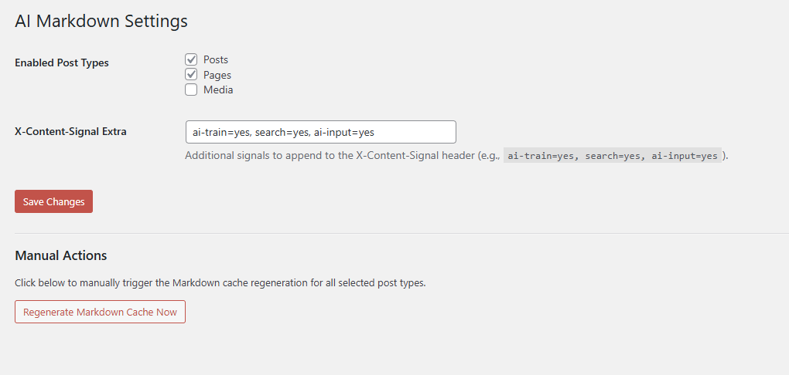

[](#)  [](#)  


## AI Markdown Content Negotiator

A WordPress plugin that detects when a request is made for content in Markdown format (via the `Accept: text/markdown` header) and serves a clean, pre-generated Markdown version of the page instead of HTML.

## 🚀 Features

- **Content Negotiation**: Detects `Accept: text/markdown` and bypasses the standard theme template.
- **YAML Frontmatter**: Automatically prepends metadata (Title, Date, Author, Categories, Permalink).
- **Automated Caching**: Uses WP-Cron to pre-generate Markdown for all published posts and pages to minimize response time.
- **LLM-Friendly Headers**:
  - `X-Markdown-Tokens`: Estimates token count using standard heuristics.
  - `X-Content-Signal`: Provides document metadata (type, depth, priority) and custom signals.
- **Customizable**: Admin settings page to select Post Types and configure global content signals.

## 📥 Installation

1. Clone or download this repository.
2. Upload the folder to your `wp-content/plugins/` directory.
3. Activate the plugin in the WordPress Admin.
4. Go to **Settings > AI Markdown** to configure your settings.

## 🛠 Usage

To request the Markdown version of a post, include the appropriate header in your HTTP request:

```bash
curl -H "Accept: text/markdown" https://yourdomain.com/your-post/
```

### Response Example

```markdown
---
title: "Hello World"
date: "2026-02-20 12:00:00"
author: "Serkan Algur"
permalink: "https://yourdomain.com/hello-world/"
categories: ["Uncategorized"]
---

# Hello World

Welcome to WordPress. This is your first post. Edit or delete it, then start writing!
```

## ⚙️ Configuration

Available under **Settings > AI Markdown**:

- **Enabled Post Types**: Select which post types (post, page, etc.) should be available in Markdown.
- **X-Content-Signal Extra**: Add custom global signals like `ai-train=yes, search=yes`.
- **Manual Regeneration**: Trigger a full cache refresh for all posts.


## Screenshot



## 📝 License

GPL-2.0+
